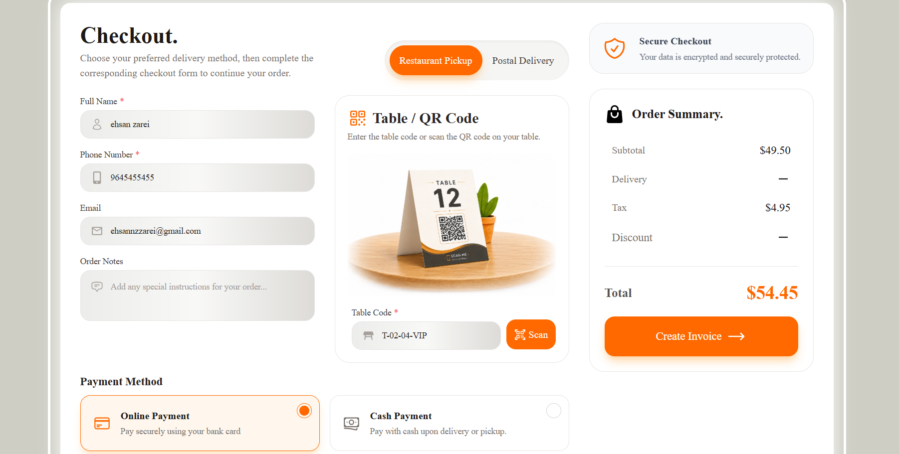
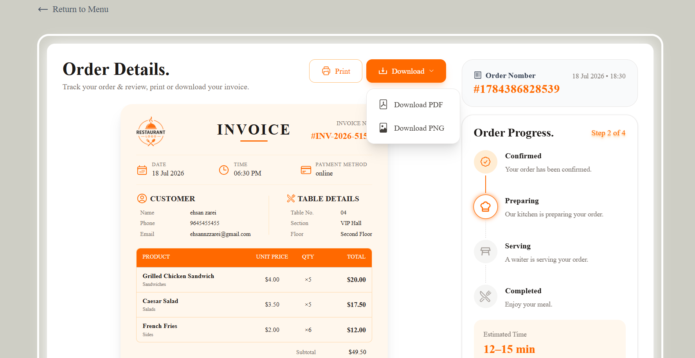
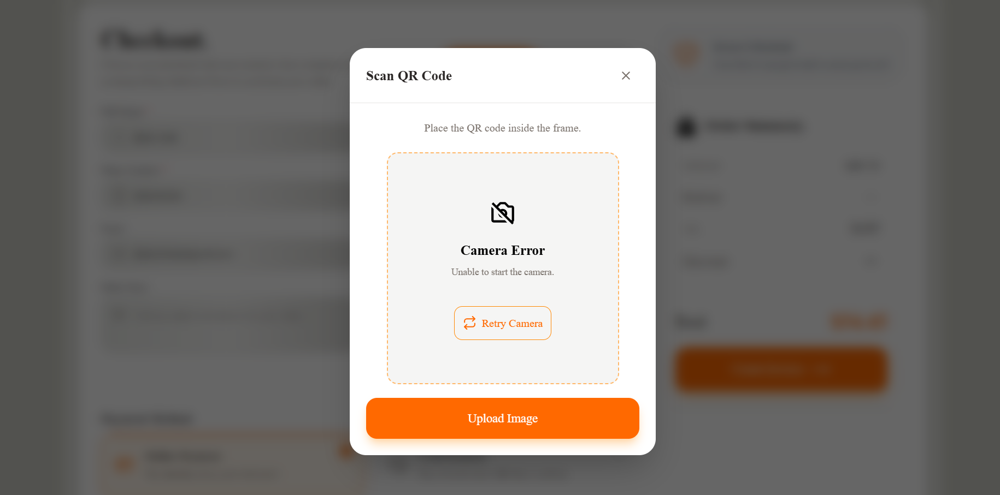
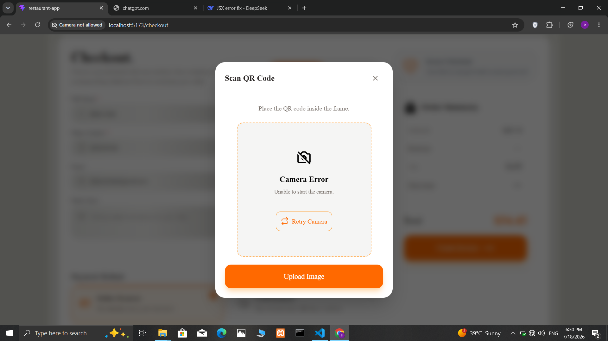

# 🍽️ QR Restaurant Invoice & Checkout Template

A modern React + Vite restaurant checkout and invoice template with QR table support.

This project is designed as a reusable front-end template for restaurants, cafés, food courts and QR ordering systems.

---

# 📸 Screenshots

### Cart


### Checkout



### Invoice



### QR Scanner



---

## ✨ Features

### 🛒 Shopping Cart
- Add / Remove items
- Increase / Decrease quantity
- Live total calculation
- Discount coupon support
- Tax calculation
- Delivery fee calculation

### 📦 Checkout
- Restaurant / Delivery modes
- Dynamic form fields
- Client-side validation
- Payment method selection
- Table QR support

### 📄 Invoice
- Modern printable invoice
- PNG export
- PDF export
- Browser printing
- Order metadata
- Customer information
- Payment information
- Restaurant information

### 📱 QR Scanner
- Camera QR scanning
- Image QR scanning
- Camera permission handling
- Camera error handling
- Retry support

### 🚚 Order Tracking
- Dynamic order progress
- Different flow for
  - Restaurant
  - Delivery

### 💾 Storage
- LocalStorage persistence
- Cart persistence
- Order persistence

---

# 🛠 Tech Stack

- React
- Vite
- React Router DOM
- Tailwind CSS
- Heroicons
- React Icons
- html5-qrcode
- html-to-image
- jsPDF

---

# 📂 Project Structure

```
src
│
├── components
├── pages
├── layouts
├── constants
├── utils
├── services
├── data
├── assets
└── App.jsx
```

---

# 🚀 Installation

Clone the repository

```bash
git clone https://github.com/EhsanZareiDev/restaurant-ordering-template.git
```

Install dependencies

```bash
npm install
```

Run development server

```bash
npm run dev
```

Build project

```bash
npm run build
```

---

## 🧪 Demo Data

The project includes sample data so you can test all features immediately after installation.

### Coupon

Use the following coupon code to test the discount system:

| Coupon Code | Discount |
| ------------ | -------- |
| `2020AB` | **20% OFF** |

---

### Table QR Code Format

Restaurant table codes follow the format below:

```text
T-(01-03)-(01-15)-(VIP-Main-Outdoor)
```

Meaning:

- **Floor:** `01 – 03`
- **Table Number:** `01 – 15`
- **Section:** `VIP`, `Main`, or `Terrace`

Example:

```text
T-01-05-Main
```

You can manually enter this code or scan a QR code containing the same value to test the QR Scanner feature.

---

### Sample Customer Information

You can use the following information while testing the checkout process:

- **Name:** John Smith
- **Phone:** +12025550123
- **Email:** john@example.com
- **Address:** 25 Sunset Street
- **Postal Code:** 90210

> These values are for demonstration purposes only.

# 📸 Screenshots

### Cart


### Checkout


### Invoice


### QR Scanner



---

# 📋 Current Features

- ✅ Shopping Cart
- ✅ Checkout
- ✅ Invoice
- ✅ QR Scanner
- ✅ Order Progress
- ✅ Local Storage
- ✅ PDF Export
- ✅ PNG Export
- ✅ Responsive Design

---

# 🗺 Roadmap

## Version 2

- Context API
- useReducer
- Backend Integration
- Authentication
- Dashboard
- Order Management
- Live Order Status
- Toast Notifications
- Dark Mode
- Multi Language
- Better Animations

---

# 🎯 Purpose

This project was built as a reusable restaurant checkout template and as a learning project for modern React architecture and reusable component design.

---

# 📄 License

This project is licensed under the MIT License.


---

# 👨‍💻 Author

**Ehsan Zarei**

Frontend Developer

GitHub: https://github.com/EhsanZareiDev

